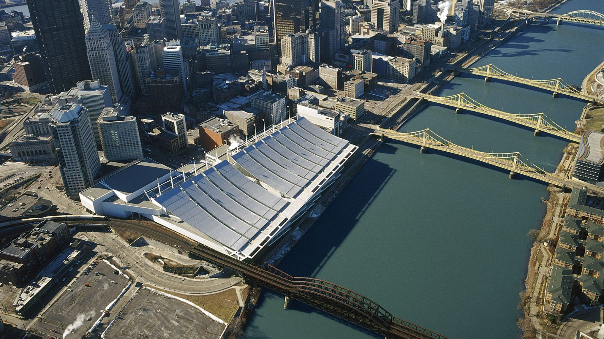
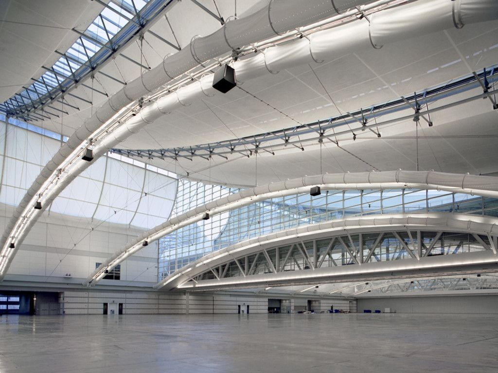

These competition rules are prepared for the _31st International RoboRacer Autonomous Racing Competition_. These are valid for this event only and extend the [General Rules]().

# Venue

The competition will take place in the [David L. Lawrence Convention Center](https://www.pittsburghcc.com/), Pittsburgh, PA, United States. It will be a part of the [2026 IEEE/RSJ International Conference on Intelligent Robots and Systems (IROS)](https://2026.ieee-iros.org).

# Vehicle Specifications

- Additional requirements:
  - Space for sticker: 40×15 mm (on a visible location; e.g., front or top of the car). Sticker will be used to certify your on-site registration.

# Track details

- _Nature of the surface (flatness, reflectiveness, material):_
  - Bare exhibition hall floor (not carpeted) - smooth concrete.

- _Nature of the room (e.g., walls/windows, ceiling type):_
  - Large conference room, and high ceilings. Windows - see pic

- _Type of delimiters (e.g., air ducts, cardboard boxes):_
  - Yellow pipes with black stripes.
  - Orange pipes with black stripes.
  - Black pipes without stripes.

- _Height of delimiters:_
  - At least 30 cm.

- _Maximum size (e.g., area) of the track:_
  - Our area is 50x30 in total. Track will be at max 43x23, likely 40x20.

- _Minimum track width (minimum distance between the inner and outer border):_
  - 1 m (however we aim to have at least 1.5 m in most of the track sections).

# Registration

Registration for the competition is split into two parts:

1. Competition registration, i.e., register a team with us to be able to compete.
2. Conference registration, i.e., register each team member to gain access to the competition area.

## Competition registration

Competition registration is done using a registration form available on the competition website. We provide up to 4 chairs, 1 table and 1 power socket for every team.

The registration is considered final (i.e., the team becomes approved) when the teams submit the form with:

- All required team data.
- A link to a video of their car driving autonomously and avoiding obstacles (~1 minute).
- A hardware list that will be made public after the competition.

Note that the approved teams will be able to update their hardware list even after finalizing their registration; however, at latest by the date of the registration deadline.
In the case of unapproved hardware (e.g., sensors out of the allowed specification) we will inform the team and give them an opportunity to change the hardware.

## Conference registration

In order to get access to the competition area, every team member must register and pay the registration fee on the IROS website.

- The competitions-only registration rate is $300 per person. This fee is available only with a given "discount code", available to all teams during the Competition registration. You should have been provided this by email, if not please reach out by September 18th (deadline for both Conference and Competition Registration)
- Other types of registration (e.g., paper author) usually contain the access to the competition area. No other registration is therefore necessary.
- Any questions, regarding the registration or visa letter, can be addressed to [contact@roboracer.ai](mailto:contact@roboracer.ai).

# Session

- Timetables of the sessions will become available on the first day of the competition.
- _List of used notification systems:_
  - Colored flags.
    - One set of flags for all teams in a heat.
    - During Head-to-Head races, the yellow flag means no overtaking (see [Multi-Agent Racing](#multi-agent-racing)).

# Practice

Practice track will contain all track features used in the competition.

- _List of Practice variants:_
  - Shared Practice.
  - Open Practice.
  - Closed Practice.
- Practice track will have the same layout as the track used during the competition.

# Inspection

Car inspection will be done during the first day of the competition. Generally, we will confirm that your car matches the submitted hardware list and is within the rule spec.
- When a car passes inspection, it will be given a marking tag placed on the top of the car.
- You may take part in the Practice sessions without Inspection.

# Qualification

Qualification won't be organized as a separate session. The teams will qualify for Head-to-Head races in two parts:

- Completing at least one full lap during the Time Trial without crashing.

- Obstacle avoidance and kill-switch capability will be tested during a dedicated session after the Time Trial.
  - Demonstrating ability to avoid both static and dynamic obstacles.
  - The dynamic test may involve more than one opponent moving at the same time.
  - The car MUST avoid touching and crashing into anything (including the track).
  - Multiple attempts are possible (up to the time allocated for the testing).
  - Failing the obstacle avoidance test means that the team cannot take part in the Head-to-Head races.

# Race organization

- _List of possible ways to start a race:_
  - Manual
  - All races start when the steward says "Go".
  - A countdown may precede the start unless otherwise stated.
- _Restarts:_
  - A heat is restarted if one or more cars start before the "Go" signal, or if three or more cars crash right after the start.

# Time Trial

- _Number of heats, time per heat:_
  - Two heats, 5 minutes each.
- The car configuration (including ROS parameters) may only be changed while the car is stopped. Teams that break this rule are disqualified.

# Head-to-Head

- _Number of cars racing at the same time:_
  - Up to four. This replaces the two-car format described in the General Rules.
- _Initial placement of the starting cars:_
  - Staggered Grid, up to four positions in the "zig-zag" pattern. Grid slots are assigned in Time Trial order.
    - Grid boxes are 570×300 mm and alternate sides of the track centerline, 15 cm away from it. Each box is 1.5 m behind the one ahead of it (instead of 80 cm in the General Rules).
- _Tournament type:_
  - Single Elimination
- _Competition model:_
  - Single Cup
    - Seeded with the results of the Time Trial.

- _Evaluation:_
  - Tentatively 10 laps. The final number will be announced on the first day of the competition.
  - Number of cars advancing from each heat will be announced on the first day of the competition.
- _Reconfiguration:_
  - Not allowed during a race, except while the car is stopped after a crash. This is stricter than the General Rules, which allow it whenever the car is stopped.

# Multi-Agent Racing

With up to four cars on the track, the race is not paused when a car crashes. Volunteers reset the crashed cars while the other cars keep racing, and a yellow flag stops all overtaking until the crash is cleared. These rules replace the crash procedure of the [General Rules](#race-penalties), where the race is paused and the at-fault car is placed 2 m behind.

## Autonomous driving only

- Cars MUST drive autonomously at all times during a race. Driving a car with the remote controller is not allowed at any point, not even to reset it after a crash: a crashed car is stopped with the kill-switch and carried by volunteers. Reversing a car under manual control into the path of the racing cars is exactly what this rule prevents.
- A car stopped by its Operator (see the yellow flag below) is restarted in autonomous mode.

## Crashes

- The Operator stops a crashed car with the kill-switch. Volunteers or team members, move it to the outside border of the track next to where it crashed, as close to the border as possible (for example, in a left turn, on the right-hand border).
- The car(s) that caused the crash are placed behind the other cars involved. Reset cars are placed 1.5 m apart, the same spacing as the starting grid.
- The car that was hit may be placed 1 m further forward. This is skipped when the cars are ready to restart right away, so that nobody is held up longer than necessary.
- If several cars crash within 5 seconds of the first crash, they keep their order from before the crash, except that the at-fault car(s) go to the back.
  - Example: car 2 crashes into car 1, and car 3 crashes into them as a result. Car 2 caused the crash, so the cars are placed in the order 1, 3, 2 (car 1 in front).
- If the referees cannot tell which car is at fault, or all cars involved are at fault, the cars keep their order from before the crash.
- A reset car restarts, in autonomous mode, after clearance from the organizers (a [green flag](#green-flag) pointed at its Operator).
- A car that cannot continue (e.g., a broken part) may be repaired by its team beside the track and rejoin the heat after clearance. *This can be done outside the track or in the pit stop.*
- A moving car that hits a crash scene because its Operator did not stop it in time gets a verbal warning. If it happens again, the team receives a formal warning (three warnings lead to disqualification, see the General Rules).

## Yellow flag: no overtaking

- The yellow flag is raised when a stopped car blocks the track after a crash, so that no other car crashes into it. It is not raised when a crash only displaced the track delimiters; in that case volunteers repair the track as fast as possible so that the other cars can pass.
  - During Head-to-Head races, this replaces the General Rules meaning of the yellow flag (drive slowly).
- While the flag is up, no car may overtake or pass in front of another car anywhere on the track. This includes lapped cars and cars being lapped.
- Operators may stop their car with the kill-switch to keep it from overtaking, and restart it in autonomous mode.
- Cars that reach the crash before it is cleared wait behind it.
- The flag comes down once at least 5 seconds have passed since the crash and the crash scene is clear enough for cars to pass; the crashed cars do not need to be ready to restart. From then on, cars may drive past the crashed cars and overtaking is allowed again anywhere on the track.
- The flag also comes down, or is not raised at all, when the crash is behind all the other cars by up to about half a lap: every other car has already passed the crash site and none is about to reach it again, so on a track this large there is nothing to protect them from and overtaking continues or resumes. If the crash is still not cleared by the time the cars come around to it again, the flag goes up again.
- Both changes are announced over the speakers ("yellow flag raised, no overtaking" / "flag lowered, overtaking allowed"). No whistle is used.
- Penalty for overtaking under the yellow flag: verbal warning. If it happens again, the team receives a formal warning (three warnings lead to disqualification, see the General Rules).

# Award ceremony

The Award ceremony will be held at the end of the race day on Wednesday.

- Wednesday, 18:00−21:00
